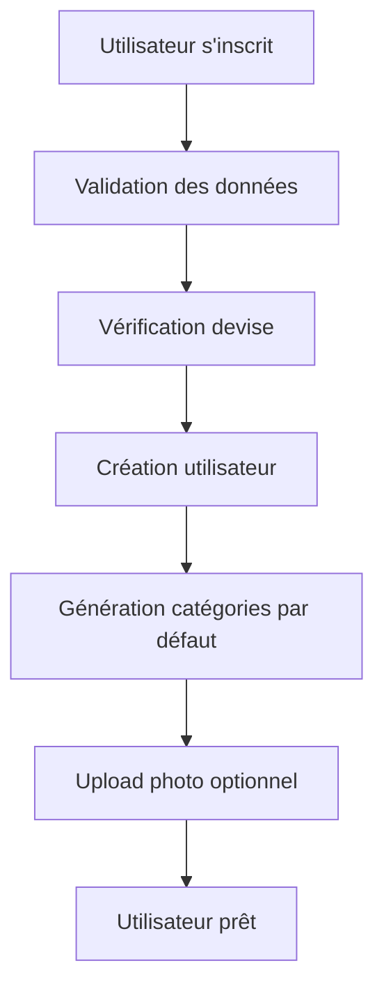
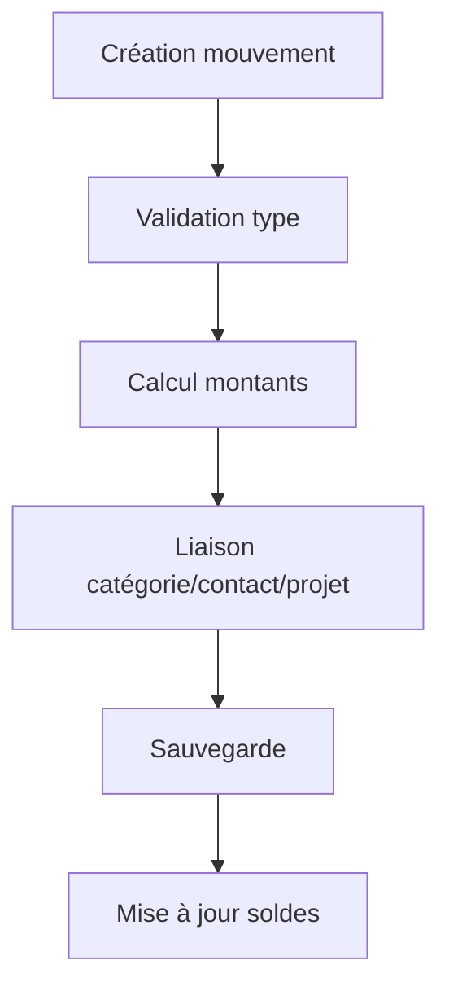
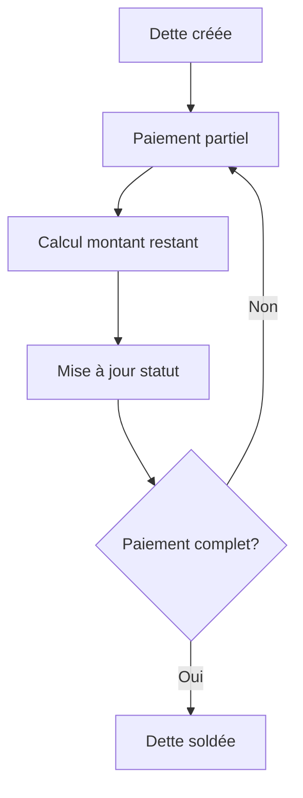

# 🎯 SoldeTrack - Présentation Détaillée

## 📋 **Vue d'Ensemble**

SoldeTrack est une **API REST complète** développée en **Symfony 7.3** pour la gestion financière personnelle. L'application permet aux utilisateurs de suivre leurs finances de manière organisée et intuitive.

## 🎯 **Objectifs de l'Application**

### **Problème Résolu**
- **Suivi financier complexe** : Beaucoup de personnes ont du mal à organiser leurs finances
- **Dettes échelonnées** : Gestion difficile des remboursements par tranches
- **Multi-projets** : Suivi de plusieurs projets financiers simultanément
- **Catégorisation** : Organisation des dépenses et revenus par catégories

### **Solution Apportée**
- **Interface simple** : API REST intuitive et bien documentée
- **Automatisation** : Calculs automatiques des soldes et intérêts
- **Flexibilité** : Support multi-devises et personnalisation complète
- **Sécurité** : Authentification JWT et validation stricte

## 🏗️ **Architecture Détaillée**

### **Stack Technologique**
```
Frontend (Client) ←→ API REST ←→ Base de Données
     ↓                    ↓              ↓
- React/Vue/Angular   - Symfony 7.3   - MySQL
- Mobile Apps         - Doctrine ORM  - InnoDB
- Postman/Insomnia    - JWT Auth      - UTF8MB4
```

### **Structure des Entités**
```
User (Utilisateur)
├── Devise (Devise par défaut)
├── Categories (Catégories personnalisées)
├── Contacts (Contacts financiers)
├── Projets (Projets personnels)
└── Mouvements (Transactions financières)
    ├── Depense (Dépenses avec lieu et méthode)
    ├── Entree (Revenus avec source)
    ├── Dette (Dettes avec échéance et taux)
    └── Don (Dons avec occasion)
    └── Paiements (Paiements échelonnés)
```

## 🔄 **Workflow Complet**

### **1. Inscription Utilisateur**


### **2. Gestion des Mouvements**


### **3. Paiements Échelonnés**


## 💡 **Fonctionnalités Avancées**

### **Système de Devises**
- **Support multi-devises** : XOF, EUR, USD, GBP
- **Formatage automatique** : 50,000 XOF, €1,234.56, $1,234.56
- **Conversion** : Prêt pour intégration API de conversion

### **Gestion des Photos**
- **Upload sécurisé** : Validation MIME et extension
- **Redimensionnement** : Automatique 300x300px
- **Sécurité** : Protection contre l'exécution de scripts

### **Dashboard Intelligent**
- **Soldes en temps réel** : Calcul automatique
- **Statistiques** : Par catégorie, projet, période
- **Alertes** : Dettes en retard, budgets dépassés

## 🔧 **Points Techniques**

### **Sécurité**
```php
// Authentification JWT
#[Route('/api/dashboard', name: 'api_dashboard_')]
class DashboardController extends AbstractController
{
    public function getSolde(): JsonResponse
    {
        $user = $this->getUser();
        if (!$user instanceof User) {
            return new JsonResponse(['error' => 'Non authentifié'], 401);
        }
        // ...
    }
}
```

### **Validation des Données**
```php
// Validation automatique
$errors = $this->validator->validate($user);
if (count($errors) > 0) {
    $errorMessages = [];
    foreach ($errors as $error) {
        $errorMessages[] = $error->getMessage();
    }
    return new JsonResponse(['error' => 'Données invalides', 'messages' => $errorMessages], 400);
}
```

### **Relations Bidirectionnelles**
```php
// User ↔ Devise
#[ORM\ManyToOne(targetEntity: Devise::class, inversedBy: 'users')]
private ?Devise $devise = null;

#[ORM\OneToMany(mappedBy: 'devise', targetEntity: User::class)]
private Collection $users;
```

## 📊 **Exemples d'Utilisation**

### **Création d'une Dette**
```json
POST /api/mouvements
{
    "type": "dette_a_payer",
    "montant_total": "50000.00",
    "montant_effectif": "0.00",
    "statut": "non_paye",
    "date": "2024-01-15 10:30:00",
    "description": "Achat de vêtements",
    "categorie_id": 3,
    "contact_id": 1,
    "echeance": "2024-02-15",
    "taux": "0.00",
    "montant_rest": "50000.00"
}
```

### **Paiement Échelonné**
```json
POST /api/paiements
{
    "mouvement_id": 1,
    "montant": "20000.00",
    "date": "2024-01-20 14:00:00",
    "commentaire": "Premier acompte",
    "statut": "paye"
}
```

### **Résultat Automatique**
```json
{
    "mouvement": {
        "id": 1,
        "montant_effectif": "20000.00",
        "montant_rest": "30000.00",
        "statut": "partiellement_paye"
    }
}
```

## 🚀 **Déploiement**

### **Environnement de Développement**
```bash
# Configuration locale
cp .env .env.local
# Modifier DATABASE_URL, JWT_SECRET_KEY, etc.

# Démarrage
symfony serve
```

### **Environnement de Production**
```bash
# Optimisation
composer install --no-dev --optimize-autoloader
php bin/console cache:clear --env=prod

# Serveur web
# Apache/Nginx avec PHP-FPM
```

## 📈 **Métriques et Performance**

### **Optimisations**
- **Requêtes optimisées** : Doctrine Query Builder
- **Cache** : Symfony Cache Component
- **Indexation** : Index sur les clés étrangères
- **Pagination** : Pour les listes importantes

### **Monitoring**
- **Logs** : Symfony Logger
- **Erreurs** : Gestion centralisée
- **Performance** : Profiling avec Symfony Profiler

## 🔮 **Roadmap Future**

### **Phase 1** (Actuelle)
- ✅ API REST complète
- ✅ Authentification JWT
- ✅ Gestion des mouvements
- ✅ Paiements échelonnés

### **Phase 2** (Prochaine)
- 🔄 Interface web React
- 🔄 Application mobile
- 🔄 Rapports PDF
- 🔄 Notifications push

### **Phase 3** (Future)
- 🔄 IA pour catégorisation automatique
- 🔄 Prédictions financières
- 🔄 Intégration banques
- 🔄 Mode hors ligne

## 👥 **Équipe et Contribution**

### **Développement**
- **Backend** : Symfony 7.3, Doctrine ORM
- **Frontend** : React/Vue.js (à venir)
- **Mobile** : React Native/Flutter (à venir)

### **Contribution**
- **Issues** : Signalement de bugs
- **Pull Requests** : Améliorations
- **Documentation** : Amélioration de la doc

---

**SoldeTrack** - Simplifiez votre gestion financière ! 💰🚀
