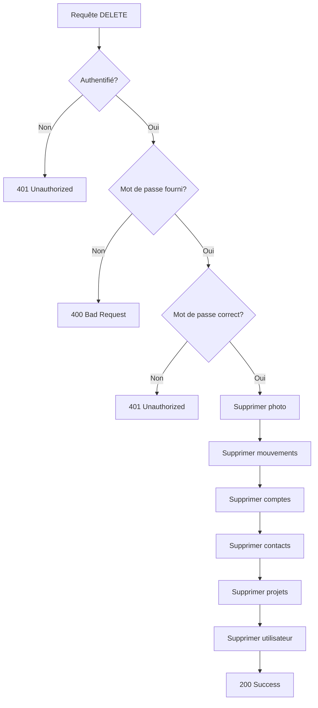

# API Suppression de Compte

## 📋 Vue d'ensemble

L'endpoint de suppression de compte permet à un utilisateur authentifié de supprimer définitivement son compte et toutes ses données associées.

## 🔗 Endpoint

```
DELETE /api/auth/delete-account
```

## 🔐 Authentification

- **Type** : Bearer Token (JWT)
- **Obligatoire** : Oui
- **Header** : `Authorization: Bearer {token}`

## 📝 Paramètres

### Body (JSON)

| Paramètre | Type | Obligatoire | Description |
|-----------|------|--------------|-------------|
| `password` | string | ✅ Oui | Mot de passe de l'utilisateur pour confirmation |

### Exemple de requête

```json
{
  "password": "mot_de_passe_utilisateur"
}
```

## 📤 Réponses

### ✅ Succès (200 OK)

```json
{
  "message": "Compte supprimé avec succès",
  "success": true
}
```

### ❌ Erreurs

#### 401 - Non authentifié
```json
{
  "error": "Non authentifié"
}
```

#### 400 - Mot de passe manquant
```json
{
  "error": "Mot de passe requis",
  "message": "Veuillez confirmer votre mot de passe pour supprimer votre compte"
}
```

#### 401 - Mot de passe incorrect
```json
{
  "error": "Mot de passe incorrect",
  "message": "Le mot de passe fourni est incorrect"
}
```

#### 500 - Erreur serveur
```json
{
  "error": "Erreur lors de la suppression",
  "message": "Une erreur est survenue lors de la suppression de votre compte"
}
```

## 🗑️ Données supprimées

L'endpoint supprime **TOUTES** les données de l'utilisateur :

### 1. **Photo de profil**
- Suppression du fichier physique du serveur
- Nettoyage de la référence en base de données

### 2. **Mouvements financiers**
- Toutes les entrées (revenus)
- Toutes les sorties (dépenses)
- Toutes les dettes
- Tous les dons
- Tous les transferts

### 3. **Comptes**
- Comptes bancaires
- Comptes d'épargne
- Comptes Mobile Money
- Tous les soldes et historiques

### 4. **Contacts**
- Liste de contacts
- Informations de débiteurs/créanciers

### 5. **Projets**
- Projets financiers
- Objectifs d'épargne

### 6. **Utilisateur**
- Profil utilisateur
- Données personnelles
- Préférences

## 🔒 Sécurité

### Mesures de sécurité implémentées

1. **Authentification obligatoire**
   - Token JWT valide requis
   - Vérification de l'identité de l'utilisateur

2. **Confirmation par mot de passe**
   - L'utilisateur doit fournir son mot de passe actuel
   - Vérification du mot de passe avant suppression

3. **Suppression en cascade**
   - Suppression automatique de toutes les données liées
   - Nettoyage complet des fichiers

4. **Gestion des erreurs**
   - Messages d'erreur sécurisés
   - Pas d'exposition d'informations sensibles

## 📱 Exemples d'utilisation

### JavaScript/Fetch

```javascript
async function deleteAccount(password) {
  try {
    const response = await fetch('/api/auth/delete-account', {
      method: 'DELETE',
      headers: {
        'Content-Type': 'application/json',
        'Authorization': `Bearer ${token}`
      },
      body: JSON.stringify({
        password: password
      })
    });

    const data = await response.json();
    
    if (response.ok) {
      console.log('Compte supprimé avec succès');
      return true;
    } else {
      console.error('Erreur:', data.error);
      return false;
    }
  } catch (error) {
    console.error('Erreur réseau:', error);
    return false;
  }
}
```

### Flutter/Dart

```dart
Future<bool> deleteAccount(String password) async {
  try {
    var response = await http.delete(
      Uri.parse('$baseUrl/api/auth/delete-account'),
      headers: {
        'Content-Type': 'application/json',
        'Authorization': 'Bearer $token',
      },
      body: json.encode({
        'password': password,
      }),
    );

    if (response.statusCode == 200) {
      var data = json.decode(response.body);
      return data['success'] == true;
    }
    
    return false;
  } catch (e) {
    print('Erreur suppression compte: $e');
    return false;
  }
}
```

### cURL

```bash
curl -X DELETE \
  -H "Content-Type: application/json" \
  -H "Authorization: Bearer YOUR_JWT_TOKEN" \
  -d '{"password":"user_password"}' \
  https://your-api.com/api/auth/delete-account
```

## ⚠️ Avertissements importants

### ⚠️ Action irréversible
- **Une fois supprimé, le compte ne peut pas être récupéré**
- **Toutes les données sont définitivement perdues**
- **Aucune possibilité de restauration**

### ⚠️ Impact sur l'application
- **Déconnexion automatique** après suppression
- **Perte de tous les historiques financiers**
- **Suppression des comptes et soldes**
- **Perte des contacts et projets**

### ⚠️ Recommandations
- **Sauvegarder les données importantes** avant suppression
- **Exporter les rapports** si nécessaire
- **Confirmer l'action** dans l'interface utilisateur
- **Avertir l'utilisateur** des conséquences

## 🔄 Flux de suppression



## 📊 Codes de statut HTTP

| Code | Signification | Description |
|------|---------------|-------------|
| 200 | OK | Compte supprimé avec succès |
| 400 | Bad Request | Mot de passe manquant |
| 401 | Unauthorized | Non authentifié ou mot de passe incorrect |
| 500 | Internal Server Error | Erreur lors de la suppression |

## 🧪 Tests

### Test de suppression réussie

```bash
# 1. Se connecter pour obtenir un token
curl -X POST https://api.example.com/api/auth/login \
  -H "Content-Type: application/json" \
  -d '{"email":"user@example.com","password":"password"}'

# 2. Supprimer le compte avec le token
curl -X DELETE https://api.example.com/api/auth/delete-account \
  -H "Content-Type: application/json" \
  -H "Authorization: Bearer YOUR_TOKEN" \
  -d '{"password":"password"}'
```

### Test de validation

```bash
# Test sans mot de passe
curl -X DELETE https://api.example.com/api/auth/delete-account \
  -H "Content-Type: application/json" \
  -H "Authorization: Bearer YOUR_TOKEN" \
  -d '{}'

# Test avec mauvais mot de passe
curl -X DELETE https://api.example.com/api/auth/delete-account \
  -H "Content-Type: application/json" \
  -H "Authorization: Bearer YOUR_TOKEN" \
  -d '{"password":"wrong_password"}'
```

## 📝 Notes de développement

### Implémentation technique
- **Framework** : Symfony 6+
- **ORM** : Doctrine
- **Sécurité** : JWT + Password Hashing
- **Gestion des fichiers** : PhotoUploadService

### Considérations de performance
- **Suppression en cascade** optimisée
- **Transaction unique** pour la cohérence
- **Nettoyage des fichiers** asynchrone possible

### Monitoring recommandé
- **Logs de suppression** pour audit
- **Métriques d'utilisation** de l'endpoint
- **Alertes** en cas d'erreurs fréquentes

---

**Version** : 1.0  
**Dernière mise à jour** : 25 Janvier 2025  
**Auteur** : Équipe SoldeTrack API
